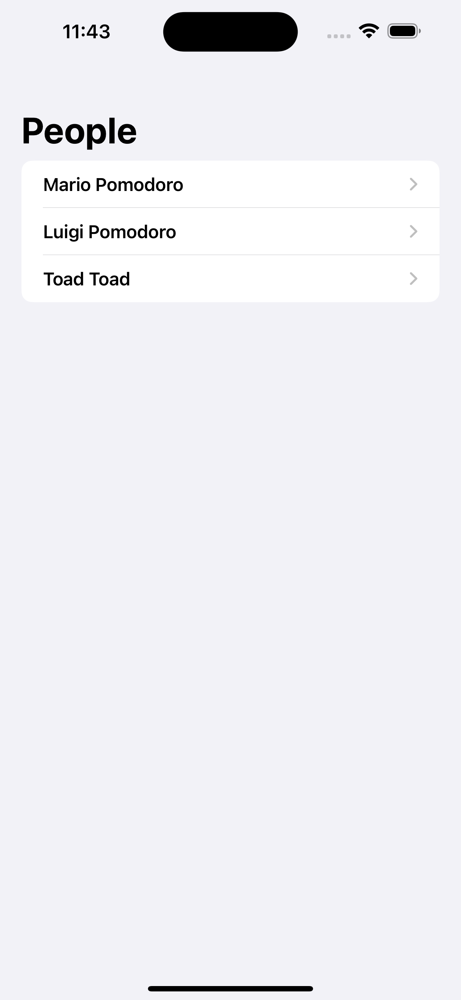
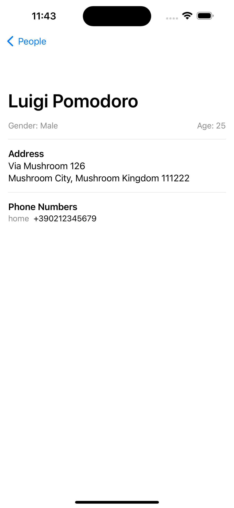

# CSE 3218 - JSON Parsing 

## Created By

- **Name**: `Raihan Hossain Rakib`
- **Roll**: `2007005`
- **Lab Group**: `A1`
- **Department**: `CSE`
- **University**: `Khulna University of Engineering & Technology`

## Screenshots

    
    

## Overview

This project demonstrates how to parse JSON data in a mobile application. It includes features for fetching, parsing, and displaying JSON data from a remote server.

## Features

- **Fetch JSON Data**: Retrieve JSON data from a specified URL.
- **Parse JSON Data**: Convert JSON data into usable objects within the application.
- **Display Data**: Present the parsed data in a user-friendly format.
- **Error Handling**: Manage errors that may occur during data fetching and parsing.
- **User Interface**: Simple and intuitive UI for displaying the data.

## Installation

1. Clone the repository.
2. Open the project in XCode.
3. Build and run the project on your mobile device or emulator.

## Usage

1. Launch the application.
2. Use the provided interface to fetch and display JSON data.
3. Explore the list view to browse available data or select an item for detailed information.